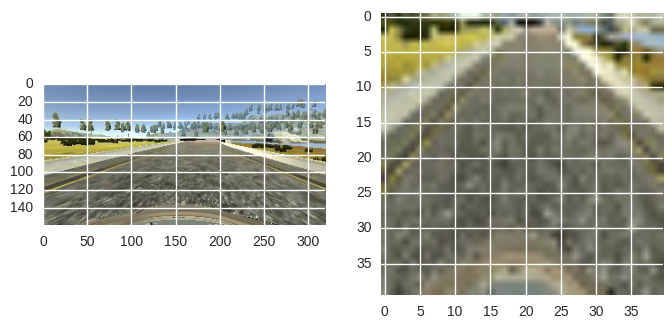

Data
====
The key to behavioral cloning is having enough behaviour to clone. I used 
multiple datasets, and the key ones to test performance were left and right
cameras from udacity dataset. Unfortunately I could not collect left and
right cameras datasets myself, as the continuous version of the simulator
only recorded the front camera. 

Additionally, I collected an additional datasets (training and validation)
of the stubborn left corner after the bridge.

Preprocessing
-------------
Images contain quite a small amount of useful information, as the only
import part to recognize is the path, and the path is very uniform. Hence
I managed to get away with cutting 60 pixels of the top, and resizing the
remaing part to 40x40 pixels. This way I could train the deep net without
any troubles on my laptop GPU.

Augmentation
------------
The only obviously useful technique was to horizontally flip the image and
the sign of the corresponding angles. Shifting or rotating (with
corresponding angle modifications) did not work for me.

An unexpected and insane trick, which helped me to finally get a version
that passes the track, was to multiply the training angles by 2. It makes
the car more "nervous" and hence more able to deal with sharp corners.

Model
=====
There was nothing special about this task to warrant an involved design of 
the conv net. I took the Lenet, made it into a regression and played around
with parameters. Since the images are resized into 40x40 pixels, not much
change was required.

Architecture
------------
The model has the following composition:

* two convolutional layers (of sizes 3x3x32 and 3x3x128) 
* two maxpool (of size 2x2) 
* two dropout (with p=0.5) 
* and two dense (of sizes 256 and 128) in the end.

Convolution and maxpool work well on 2D images, making use of translation
invariance. Dropout adds regularization for the convolutional layers, 
and adding it to dense layers made no difference.

Train/validation/test splits
----------------------------
Validation dataset was split off the end of each collection to check for
over fitting. When it became clear that model is not over fitting, I used 
the difficult cases (left corner after the bridge) for validation.

I did not use a test set, instead, observed the behaviour of the car on the
track.

